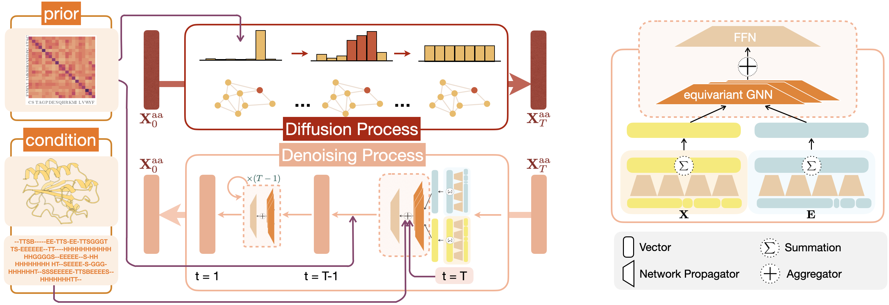

# GraDe_IF: Graph Denoising Diffusion for Inverse Protein Folding (NeurIPS 2023)

## Description
Implementation for "Graph Denoising Diffusion for Inverse Protein Folding" [arxiv link](https://arxiv.org/abs/2306.16819).

## Requirements

To install requirements:

```
conda env create -f environment.yml
```

## Usage
Like [denoising-diffusion-pytorch](https://github.com/lucidrains/denoising-diffusion-pytorch), there is a brief introduction to show how this discrete diffusion work.
```python
import sys
sys.path.append('diffusion')

import torch
from torch_geometric.data import Batch
from diffusion.gradeif import GraDe_IF,EGNN_NET
from dataset_src.generate_graph import prepare_graph

gnn = EGNN_NET(input_feat_dim=input_graph.x.shape[1]+input_graph.extra_x.shape[1],hidden_channels=10,edge_attr_dim=input_graph.edge_attr.shape[1])

diffusion_model = GraDe_IF(gnn)

graph = torch.load('dataset/process/test/3fkf.A.pt')
input_graph = Batch.from_data_list([prepare_graph(graph)])

loss = diffusion_model(input_graph)
loss.backward()

_,sample_seq = diffusion_model.ddim_sample(input_graph) #using structure information generate sequence
```
More details can be found [notebook](diffusion/inverse_folding.ipynb)

## Comments 

- Our codebase for the EGNN models and discrete diffusion builds on [EGNN](https://github.com/lucidrains/egnn-pytorch), [DiGress](https://github.com/cvignac/DiGress).
Thanks for open-sourcing!

## Citation 
If you consider our codes and datasets useful, please cite:
```
@article{yi2023graph,
      title={Graph Denoising Diffusion for Inverse Protein Folding}, 
      author={Kai Yi and Bingxin Zhou and Yiqing Shen and Pietro Liò and Yu Guang Wang},
      year={2023},
      eprint={2306.16819},
      archivePrefix={arXiv},
      primaryClass={q-bio.QM}
}
```
